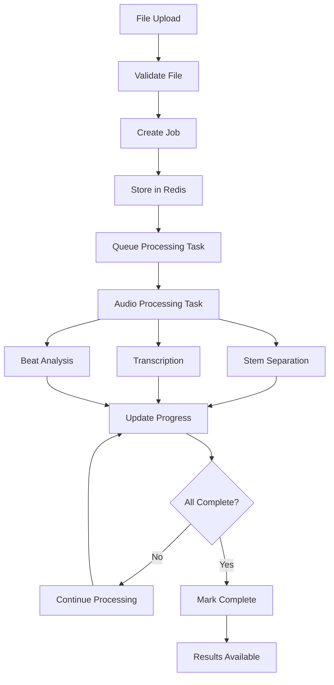

# Karaoke Backend Architecture

## Overview

The Karaoke Backend is a scalable, asynchronous audio processing system built with FastAPI, Celery, and Redis. It transforms audio files into karaoke-ready content through stem separation, vocal transcription, and beat analysis.

## System Architecture

```
┌─────────────────┐    ┌─────────────────┐    ┌─────────────────┐
│   Frontend      │    │   FastAPI       │    │   Celery        │
│   Application   │◄──►│   Web Server    │◄──►│   Workers       │
└─────────────────┘    └─────────────────┘    └─────────────────┘
                                │                        │
                                ▼                        ▼
                       ┌─────────────────┐    ┌─────────────────┐
                       │     Redis       │    │   AI Models     │
                       │  (Job Queue &   │    │   - Demucs      │
                       │   Job State)    │    │   - Whisper     │
                       └─────────────────┘    │   - Librosa     │
                                              └─────────────────┘
                                                       │
                                                       ▼
                                              ┌─────────────────┐
                                              │  File Storage   │
                                              │  (Local/Cloud)  │
                                              └─────────────────┘
```

## Core Components

### 1. FastAPI Web Server (`app.py`)

**Role**: HTTP API Gateway and Request Handler

**Responsibilities**:
- Handle HTTP requests/responses
- File upload validation and storage
- Job creation and status tracking
- Serve processed files
- CORS and security middleware

**Key Features**:
- Asynchronous request handling
- Automatic API documentation (Swagger/OpenAPI)
- Request/response validation with Pydantic
- Error handling and logging
- Health check endpoints

**Routes**:
- `/health` - Health monitoring
- `/api/process` - File upload and job creation
- `/api/status/{job_id}` - Job status tracking
- `/api/results/{job_id}` - Results retrieval
- `/api/files/{job_id}/{filename}` - File downloads

### 2. Celery Task Queue (`celery_app.py`, `worker.py`)

**Role**: Asynchronous Task Processing Engine

**Architecture**:
```
┌─────────────────┐    ┌─────────────────┐    ┌─────────────────┐
│   Web Server    │    │     Redis       │    │   Workers       │
│   (Producer)    │───►│   (Broker)      │───►│  (Consumers)    │
└─────────────────┘    └─────────────────┘    └─────────────────┘
                                │
                                ▼
                       ┌─────────────────┐
                       │   Task Results  │
                       │   (Backend)     │
                       └─────────────────┘
```

**Task Queues**:
- `audio_processing` - Main orchestration tasks
- `stem_separation` - Audio stem separation tasks
- `transcription` - Vocal transcription tasks
- `beat_analysis` - Rhythm and tempo analysis tasks

**Worker Configuration**:
```python
# Multi-queue worker support
celery -A celery_app worker --loglevel=info --queues=audio_processing,stem_separation,transcription,beat_analysis
```

### 3. Redis Database (`database/redis_client.py`)

**Role**: Message Broker and State Management

**Data Structures**:

**Job State** (`job:{job_id}`):
```redis
HSET job:550e8400-e29b-41d4-a716-446655440000
  status "processing"
  progress 75
  current_step "beat_analysis"
  created_at "2024-01-01T10:00:00"
  updated_at "2024-01-01T10:03:45"
  job_dir "/path/to/job/directory"
  original_filename "song.mp3"
  audio_duration 180.0
  file_size 4500000
  
  # Stem separation results
  stem_separation_status "completed"
  stem_separation_progress 100
  vocals_path "/path/to/vocals.wav"
  drums_path "/path/to/drums.wav"
  bass_path "/path/to/bass.wav"
  other_path "/path/to/other.wav"
  stem_separation_time 45.2
  stem_separation_model "htdemucs"
  
  # Transcription results
  transcription_status "completed"
  transcription_path "/path/to/transcription.json"
  transcription_language "en"
  transcription_word_count 156
  transcription_time 12.3
  
  # Beat analysis results
  beat_analysis_status "processing"
  tempo_bpm 120.5
  beat_count 240
  time_signature "4/4"
  beat_confidence 0.95
  rhythm_regularity 0.88
```

**Task Queue** (Celery):
```redis
# Task messages in Redis lists
LPUSH celery "task_message_json"
```

### 4. AI Models Integration

#### A. Demucs (Stem Separation) - `ai_models/demucs_handler.py`

**Purpose**: Separate audio into instrumental tracks

**Model**: `htdemucs` (Hybrid Transformer Demucs)

**Process**:
1. Load audio file with librosa
2. Preprocess audio (normalize, resample)
3. Run Demucs inference
4. Export separated stems as WAV files

**Output**: 4 audio files (vocals, drums, bass, other)

**Performance**: ~30-60 seconds for 3-minute song

#### B. Whisper (Transcription) - `ai_models/whisper_handler.py`

**Purpose**: Transcribe vocals to text with timestamps

**Model**: OpenAI Whisper (configurable: tiny, base, small, medium, large)

**Process**:
1. Use vocals stem from Demucs
2. Optimize audio for speech recognition
3. Run Whisper inference with word-level timestamps
4. Export transcription as JSON

**Output**: JSON with text, segments, and word-level timestamps

**Performance**: ~5-15 seconds for 3-minute song

#### C. Librosa (Beat Analysis) - `ai_models/librosa_handler.py`

**Purpose**: Analyze rhythm, tempo, and beat structure

**Features**:
- Tempo detection (BPM)
- Beat tracking
- Onset detection
- Time signature estimation
- Rhythm regularity analysis

**Process**:
1. Load original audio file
2. Extract tempo and beats using onset detection
3. Generate beat grid for synchronization
4. Calculate rhythm metrics
5. Export analysis as JSON

**Output**: JSON with tempo, beats, onsets, and metrics

**Performance**: ~1-3 seconds for 3-minute song

### 5. File Storage System (`utils/file_handler.py`)

**Structure**:
```
storage/
├── uploads/           # Temporary uploaded files
└── jobs/             # Job-specific directories
    └── {job_id}/
        ├── original.mp3      # Original uploaded file
        ├── stems/           # Separated audio tracks
        │   ├── vocals.wav
        │   ├── drums.wav
        │   ├── bass.wav
        │   └── other.wav
        ├── transcription/   # Transcription results
        │   └── transcription.json
        └── beat_analysis/   # Beat analysis results
            ├── analysis.json
            ├── beats.json
            └── onsets.json
```

**Security Features**:
- Directory traversal protection
- File type validation
- Size limits enforcement
- Secure file serving with proper headers

## Processing Pipeline

### Complete Workflow



### Task Orchestration (`tasks/audio_processing.py`)

**Main Pipeline**:
```python
@celery_app.task(bind=True, queue='audio_processing')
def process_audio_file(self, job_id, file_path, job_dir):
    # 1. Initialize job state
    update_job_status(job_id, JobStatus.PROCESSING, 0, ProcessingStep.INITIALIZING)
    
    # 2. Stem separation (33% of progress)
    stem_separation.delay(job_id, file_path, job_dir)
    
    # 3. Transcription (66% of progress)
    transcription.delay(job_id, vocals_path, job_dir)
    
    # 4. Beat analysis (100% of progress)
    beat_analysis.delay(job_id, file_path, job_dir)
    
    # 5. Finalize
    update_job_status(job_id, JobStatus.COMPLETED, 100, ProcessingStep.COMPLETED)
```

**Error Handling**:
- Retry logic for transient failures
- Graceful degradation (partial results)
- Comprehensive error logging
- Job state preservation

## Configuration Management (`config.py`)

**Environment Variables**:
```python
# Application
APP_NAME="Karaoke Backend"
DEBUG=True
HOST="0.0.0.0"
PORT=8000

# Redis
REDIS_HOST="localhost"
REDIS_PORT=6379
REDIS_DB=0

# Celery
CELERY_BROKER_URL="redis://localhost:6379/0"
CELERY_RESULT_BACKEND="redis://localhost:6379/0"

# File Processing
MAX_FILE_SIZE="100MB"
ALLOWED_EXTENSIONS="mp3,wav,m4a,flac"

# AI Models
WHISPER_MODEL="base"
DEMUCS_MODEL="htdemucs"
AUDIO_SAMPLE_RATE=44100

# Processing
MAX_CONCURRENT_JOBS=3
JOB_TIMEOUT=3600
CLEANUP_INTERVAL=86400
```

## Scalability & Performance

### Horizontal Scaling

**Multiple Workers**:
```bash
# Scale workers by starting multiple processes
celery -A celery_app worker --concurrency=4 --queues=stem_separation
celery -A celery_app worker --concurrency=2 --queues=transcription
celery -A celery_app worker --concurrency=2 --queues=beat_analysis
```

**Load Balancing**:
- Multiple FastAPI instances behind load balancer
- Redis cluster for high availability
- Shared file storage (NFS/S3)

### Performance Optimizations

**Audio Processing**:
- GPU acceleration for Demucs (CUDA support)
- Parallel processing of different stages
- Memory-efficient audio loading
- Progressive result streaming

**Caching**:
- Redis for job state and intermediate results
- File system caching for models
- HTTP caching headers for static files

**Resource Management**:
- Memory limits per worker
- CPU affinity for intensive tasks
- Disk space monitoring and cleanup

## Monitoring & Observability

### Logging (`utils/logger.py`)

**Structured Logging**:
```python
logger.info("Job started", 
           job_id=job_id, 
           filename=filename, 
           file_size=file_size)

logger.error("Processing failed", 
            job_id=job_id, 
            error=str(e), 
            exc_info=True)
```

**Log Levels**:
- `DEBUG` - Detailed processing information
- `INFO` - Job lifecycle events
- `WARNING` - Recoverable errors
- `ERROR` - Processing failures
- `CRITICAL` - System failures

### Health Monitoring

**Health Check** (`/health`):
```python
{
  "status": "healthy",
  "services": {
    "redis": "connected",
    "celery": "active",
    "disk_space": "sufficient",
    "memory": "normal"
  },
  "metrics": {
    "active_jobs": 2,
    "queue_length": 5,
    "avg_processing_time": 45.2
  }
}
```

### Metrics Collection

**Key Metrics**:
- Job completion rate
- Average processing time per stage
- Error rates by component
- Resource utilization (CPU, memory, disk)
- Queue lengths and wait times

## Security Considerations

### Input Validation

**File Upload Security**:
- File type validation (magic number checking)
- Size limits enforcement
- Virus scanning (optional)
- Content sanitization

**API Security**:
- Request rate limiting
- Input validation with Pydantic
- SQL injection prevention (using Redis, not SQL)
- CORS configuration

### File Access Control

**Path Security**:
```python
def is_safe_path(basedir: str, path: str) -> bool:
    """Prevent directory traversal attacks"""
    basedir = os.path.abspath(basedir)
    path = os.path.abspath(os.path.join(basedir, path))
    return path.startswith(basedir)
```

**Access Control**:
- Job-based file access (users can only access their job files)
- Temporary file cleanup
- Secure file serving headers

## Error Handling & Recovery

### Error Categories

1. **User Errors** (4xx):
   - Invalid file format
   - File too large
   - Malformed requests

2. **System Errors** (5xx):
   - AI model failures
   - Storage issues
   - Network problems

3. **Processing Errors**:
   - Audio corruption
   - Model inference failures
   - Resource exhaustion

### Recovery Strategies

**Retry Logic**:
```python
@celery_app.task(bind=True, autoretry_for=(Exception,), 
                retry_kwargs={'max_retries': 3, 'countdown': 60})
def process_task(self, ...):
    # Task implementation
```

**Graceful Degradation**:
- Continue processing if one stage fails
- Provide partial results
- Clear error messaging

**Data Consistency**:
- Atomic Redis operations
- Transaction rollback on failures
- Cleanup of partial results

## Development & Deployment

### Local Development

**Setup**:
```bash
# 1. Install dependencies
pip install -r requirements.txt

# 2. Start Redis
redis-server

# 3. Start Celery workers
celery -A celery_app worker --loglevel=info

# 4. Start FastAPI server
python app.py
```

### Production Deployment

**Docker Containers**:
- FastAPI app container
- Celery worker containers
- Redis container
- Nginx reverse proxy

**Process Management**:
- Supervisor for process monitoring
- Health checks and auto-restart
- Log rotation and management

**Monitoring**:
- Prometheus metrics collection
- Grafana dashboards
- Alerting for failures

## Future Enhancements

### Planned Features

1. **Real-time Updates**:
   - WebSocket support for live progress
   - Server-sent events for status updates

2. **Advanced Processing**:
   - Multiple AI model options
   - Custom processing parameters
   - Batch processing support

3. **Cloud Integration**:
   - AWS S3 storage
   - GPU-accelerated processing
   - Auto-scaling workers

4. **API Enhancements**:
   - Authentication and authorization
   - Rate limiting and quotas
   - API versioning

### Scalability Roadmap

1. **Phase 1**: Single-machine optimization
2. **Phase 2**: Multi-worker deployment
3. **Phase 3**: Microservices architecture
4. **Phase 4**: Cloud-native deployment

---

This architecture provides a robust, scalable foundation for audio processing while maintaining simplicity and developer-friendliness. The modular design allows for easy testing, debugging, and future enhancements. 